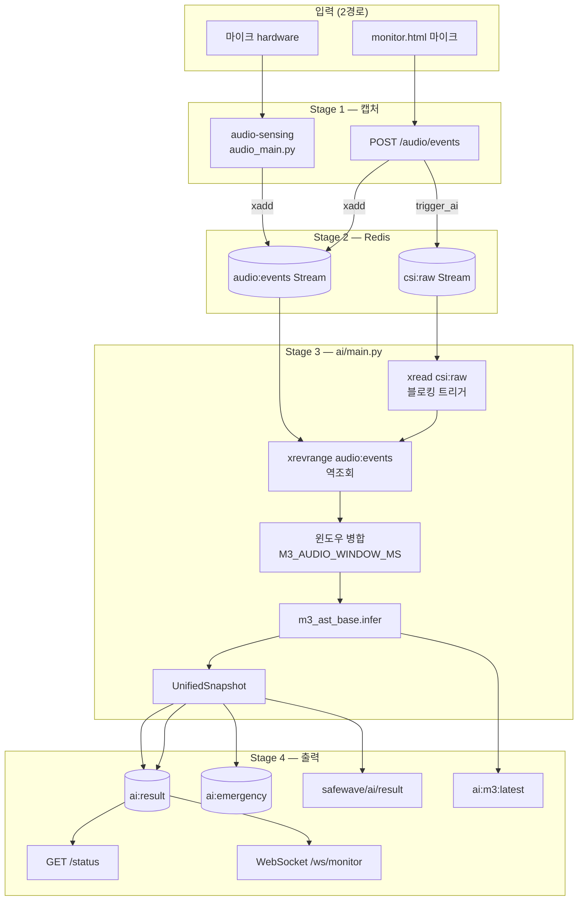

# SafeWave-AI 백엔드 연동 명세 (핸드오프)

> 백엔드/앱 개발자용. 마이크 원본 음향 → M3 환경음 모델 → Redis/API/MQTT까지의 **입력·출력·저장 위치**를 정리합니다.  
> 상세 HTML 명세: [`docs/api-db-spec.html`](./api-db-spec.html) (브라우저로 열기)

---

## 1. 서비스 구성

| 서비스 | 컨테이너 | 포트 | 역할 |
|--------|----------|------|------|
| Redis | `rp5-db` | 6379 | 스트림·캐시 허브 (영속 DB 아님, 메모리 전용) |
| Sensing (CSI) | `rp5-sensing` | 5005/UDP | WiFi CSI 수신 |
| Audio Sensing | `rp5-audio-sensing` | — | 마이크 VAD (profile: `audio`) |
| AI Worker | `rp5-ai` | — | M1~M5 추론, Redis/MQTT 기록 |
| API | `rp5-api` | **8000** | REST + WebSocket |
| MQTT | `rp5-mqtt` | 1883 | Mosquitto |

**백엔드가 주로 붙는 지점:** `http://<host>:8000` (REST/WS), Redis `6379` (직접 접근은 보통 api 경유).

---

## 2. 오디오 → M3 전체 파이프라인

### 2.1 흐름도



> **중요:** `audio:events`는 **독립 XREAD 소비 루프가 없음**. `csi:raw` 1건이 들어올 때마다 AI가 깨어나고, 그 시각 기준으로 `audio:events`를 **역조회(xrevrange)** 한다.  
> CSI 없이 M3만 테스트하려면 `POST /audio/events`에 **`trigger_ai: true`** → 더미 `csi:raw` 1건을 같이 넣는다.

---

### 2.2 Stage별 입력 / 출력

#### Stage 0 — 물리 입력

| | |
|---|---|
| **IN** | 아날로그/디지털 마이크 신호 |
| **OUT** | OS → PortAudio → float32 PCM chunk |

- 샘플레이트: **16000 Hz**, mono
- `audio-sensing` block: 1024 samples (~64 ms/chunk)

---

#### Stage 1-A — `audio-sensing` (실마이크, Docker profile `audio`)

**파일:** `sensing/audio_main.py`

| 단계 | IN | OUT |
|------|-----|-----|
| 캡처 | `float32[1024]` chunk | queue 적재 |
| VAD | chunk + `VAD_THRESHOLD_DB` (기본 -55 dBFS) | 활성 구간 waveform |
| gain 보정 | peak < 0.12 | peak 0.85까지 증폭 |
| Redis xadd | waveform + peak_db | Stream entry 1건 |

**VAD 종료 조건:** 무음 hangover 250ms 또는 최대 6초

---

#### Stage 1-B — `POST /audio/events` (앱/브라우저)

**파일:** `api/main.py` → `ingest_audio_event()`

**Request body (`AudioEventIn`):**

```json
{
  "node_id": 1,
  "waveform": [0.001, -0.02, 0.03],
  "sample_rate": 16000,
  "text_ko": null,
  "trigger_ai": true
}
```

| 필드 | 타입 | 필수 | 설명 |
|------|------|------|------|
| `node_id` | int (0~255) | O | 노드 ID |
| `waveform` | float[] | △ | PCM 샘플 (-1.0~1.0). `text_ko` 없으면 필수 |
| `sample_rate` | int | O | 8000~48000, 기본 16000 |
| `text_ko` | string? | △ | M4 STT 우회 입력 |
| `trigger_ai` | bool | O | true → `csi:raw` 더미 추가 (AI 루프 깨움) |

**처리:** waveform clip (최대 8초), `monitor.html`은 전송 전 quiet gain 보정

**Response:**

```json
{
  "status": "ok",
  "audio_event_id": "1779943598722-0",
  "csi_event_id": "1779943598722-0",
  "node_id": 1,
  "sample_rate": 16000,
  "text_len": 0,
  "waveform_samples": 48000
}
```

---

#### Stage 2 — Redis `audio:events` (Stream)

**생산:** `audio-sensing`, `api`  
**소비:** `ai` (xrevrange, CSI 트리거 시)

**Stream entry 필드:**

| 필드 | 타입 | 예시 |
|------|------|------|
| `node` | int | `1` |
| `ts_ms` | int | `1779943598722` |
| `data` | JSON string | 아래 payload |

**`data` JSON payload:**

```json
{
  "sample_rate": 16000,
  "channels": 1,
  "duration_ms": 850,
  "peak_db": -12.3,
  "waveform": [0.001, -0.02, 0.03]
}
```

| 필드 | 설명 |
|------|------|
| `sample_rate` | 16000 |
| `channels` | 1 (mono) |
| `duration_ms` | VAD 구간 길이 |
| `peak_db` | 피크 dBFS |
| `waveform` | **float32 PCM** 리스트, -1.0~1.0 |

- **maxlen:** 3600 (approximate trim)
- **Entry ID:** Redis 자동 (`{ts_ms}-0` 형태)

---

#### Stage 3 — AI Worker 오디오 조회 + 병합

**파일:** `ai/main.py`

**3-1. 트리거 (CSI)**

```python
r.xread({"csi:raw": last_id}, count=10, block=1000)
```

CSI 1건 = 추론 1회. CSI `data`는 M1/M2용 float32[512] (오디오와 별개).

**3-2. 오디오 역조회**

```python
_load_recent_audio_events(r, node_id, ts_ms, window_ms=5000)  # M4_AUDIO_WINDOW_MS
```

- `xrevrange("audio:events", count=64)`
- 필터: `ts_ms - 5000` 이후, `node_id` 일치
- 반환: `list[dict]` (Stage 2 payload + `ts_ms`)

**3-3. M3용 윈도우 병합**

```python
_merge_audio_window(audio_events, M3_AUDIO_WINDOW_MS)  # 기본 4000ms (.env)
```

| IN | OUT |
|----|-----|
| 여러 `audio:events`의 `waveform[]` | 1개 dict |

**병합 결과 (M3 입력 dict):**

```json
{
  "sample_rate": 16000,
  "channels": 1,
  "duration_ms": 2800,
  "peak_db": -8.3,
  "waveform": [0.01, -0.02, ...],
  "window_ms": 4000,
  "ts_ms": 1779943598722
}
```

- 여러 이벤트 waveform을 `concatenate`
- **`window_ms` 길이만큼 뒤에서 자름** (고정 N초 슬라이스가 아님)
- 오디오 없으면 `None` → M3 empty output

---

#### Stage 4 — M3 모델 (`m3_ast_base.py`)

**모델:** Hugging Face `MIT/ast-finetuned-audioset-10-10-0.4593`  
**경로:** `/app/models/ast_hf/` (env: `M3_ENV_SOUND_MODEL=ast_hf`)

**IN (infer 호출):**

| 형태 | 내용 |
|------|------|
| dict | `waveform`: float32[] (16 kHz mono), Stage 3 병합 결과 |
| ndarray | 1D PCM (호환) |

**내부 전처리:**

1. `_normalize_quiet_waveform()` — peak < 0.15 → 0.9까지 증폭
2. `AutoFeatureExtractor` → mel spectrogram
3. `ASTForAudioClassification` → AudioSet 527 logits
4. 527클래스 → SafeWave **6종** 집계

**OUT (M3 expert 결과):**

`ai/main.py`가 M3 `infer()` 결과에 **오디오 구간 시각**을 붙여 반환합니다.

```json
{
  "env_sound_label": "impact",
  "env_sound_confidence": 0.72,
  "env_sound_source": "hf-ast",
  "activity": "impact",
  "activity_confidence": 0.72,
  "ast_top_class": "Slam",
  "ast_top_confidence": 0.45,
  "audio_ts_ms": 1779943598500,
  "audio_ts_start_ms": 1779943595700,
  "audio_duration_ms": 2800,
  "audio_window_ms": 4000
}
```

| 출력 키 | 타입 | 설명 |
|---------|------|------|
| `env_sound_label` | string | **6종 중 1** (아래 표) |
| `env_sound_confidence` | float | 0.0~1.0 |
| `env_sound_source` | string | `hf-ast` / `heuristic` / `no-audio` |
| `ast_top_class` | string | AudioSet 원본 Top-1 클래스명 |
| `ast_top_confidence` | float | Top-1 확률 |
| `activity` | string | `env_sound_label` alias (하위 호환) |
| `audio_ts_ms` | int \| null | M3 입력 waveform **끝 시각** (Unix ms) |
| `audio_ts_start_ms` | int \| null | `audio_ts_ms - audio_duration_ms` (시작 추정) |
| `audio_duration_ms` | int \| null | 병합 waveform 길이 (ms) |
| `audio_window_ms` | int \| null | M3 윈도우 (`M3_AUDIO_WINDOW_MS`, 기본 4000) |

### 시간 필드 — 백엔드 필독

| 필드 | 의미 | 용도 |
|------|------|------|
| **`UnifiedSnapshot.ts_ms`** | CSI 패킷 시각 = **추론 1회 트리거 시각** | 파이프라인 동기, 로그 |
| **`experts.env_sound.audio_ts_ms`** | **소리가 분석된 구간의 끝 시각** | “몇 시에 충격음/비명” UI·알림 |
| **`experts.env_sound.audio_ts_start_ms`** | 분석 구간 시작 추정 | 타임라인, 구간 표시 |

```
소리 (VAD)          12:00:01.200 ──▶ audio:events
CSI 트리거          12:00:01.850 ──▶ snapshot.ts_ms
M3 분석 구간 끝     12:00:01.500 ──▶ env_sound.audio_ts_ms
```

**백엔드 최소 연동:**

```javascript
// GET /status 또는 WebSocket
const csiTime = snapshot.ts_ms;
const soundEnd = snapshot.experts.env_sound.audio_ts_ms;
const soundStart = snapshot.experts.env_sound.audio_ts_start_ms;
const label = snapshot.experts.env_sound.env_sound_label;
```

**6종 라벨:**

| `env_sound_label` | 의미 |
|-------------------|------|
| `silence` | 무음 |
| `speech` | 사람 음성 |
| `impact` | 충격음 |
| `noise` | 잡음 (TV/음악 포함) |
| `alarm` | 경보음 |
| `unknown` | 기타 |

**오디오 없을 때:**

```json
{
  "env_sound_label": "silence",
  "env_sound_confidence": 0.0,
  "env_sound_source": "no-audio",
  "audio_ts_ms": null,
  "audio_ts_start_ms": null,
  "audio_duration_ms": null,
  "audio_window_ms": null
}
```

---

#### Stage 5 — 통합 스냅샷 + 저장/배포

**파일:** `ai/main.py` → `_build_snapshot()` → `_write_snapshot()`

M3 결과는 `experts.env_sound`에 포함됩니다.

**UnifiedSnapshot (핵심 필드):**

```json
{
  "ts_ms": 1779943598722,
  "node_id": 1,
  "experts": {
    "fall": { "fall_score": 0.05, "fall_detected": false },
    "vital": { "heart_rate": 72.0, "breathing_rate": 16.0 },
    "env_sound": {
      "env_sound_label": "impact",
      "env_sound_confidence": 0.72,
      "env_sound_source": "hf-ast",
      "ast_top_class": "Slam",
      "ast_top_confidence": 0.45,
      "audio_ts_ms": 1779943598500,
      "audio_ts_start_ms": 1779943595700,
      "audio_duration_ms": 2800,
      "audio_window_ms": 4000
    },
    "speech_ko": {
      "transcript_ko": "",
      "speech_detected": false,
      "stt_confidence": 0.0
    }
  },
  "audio": {
    "sample_rate": 16000,
    "duration_ms": 2800,
    "peak_db": -8.3,
    "waveform": [...]
  },
  "risk_score": 0.70,
  "risk_level": "warning",
  "emergency": false,
  "slm_invoked": false,
  "expert_latency_ms": {
    "fall": 1.5,
    "vital": 0.9,
    "env_sound": 8500.0,
    "speech_ko": 1200.0
  }
}
```

**M3 결과가 저장·전달되는 위치:**

| 목적지 | 키/채널 | 내용 |
|--------|---------|------|
| Redis Stream | `ai:result` | UnifiedSnapshot 전체 JSON (`data` 필드) |
| Redis Stream | `ai:emergency` | warning/critical 요약만 |
| Redis String | `ai:m3:latest` | M3 마지막 결과 + ts, node, latency (TTL 1h) |
| MQTT | `safewave/ai/result` | risk_level, score, node_id 등 요약 |
| MQTT | `safewave/ai/emergency` | warning/critical 시 |
| REST | `GET /status` | `ai:result` 마지막 1건 |
| REST | `GET /logs?n=60` | `ai:result` 최근 N건 |
| WebSocket | `ws://host:8000/ws/monitor` | 새 `ai:result` push |

**`ai:m3:latest` JSON 예:**

```json
{
  "ts_ms": 1779943598722,
  "node_id": 1,
  "expert": "env_sound",
  "latency_ms": 8500.0,
  "data": {
    "env_sound_label": "impact",
    "env_sound_confidence": 0.72,
    "env_sound_source": "hf-ast",
    "audio_ts_ms": 1779943598500,
    "audio_ts_start_ms": 1779943595700,
    "audio_duration_ms": 2800,
    "audio_window_ms": 4000
  }
}
```

> wrapper `ts_ms` = CSI 시각. `data.audio_ts_ms` = 소리 구간 시각.

---

## 3. Redis DB 명세 (전체)

> **영속 DB 아님.** Redis Streams + TTL String/Hash. 컨테이너 재시작 시 이력 소실.

### 3.1 Streams

| 키 | 생산자 | 소비자 | maxlen | Entry 필드 |
|----|--------|--------|--------|------------|
| `csi:raw` | sensing, api(trigger) | ai (xread) | 36000 | `node` int, `ts_ms` int, `data` bytes |
| `audio:events` | audio-sensing, api | ai (xrevrange) | 3600 | `node` int, `ts_ms` int, `data` JSON |
| `ai:result` | ai | api (XREAD/조회) | 36000 | `data` UnifiedSnapshot JSON |
| `ai:emergency` | ai | api alert_worker | 3600 | `data` EmergencySummary JSON |

### 3.2 String / Hash

| 키 패턴 | 타입 | TTL | 내용 |
|---------|------|-----|------|
| `ai:m1:latest` ~ `ai:m4:latest` | string | 1h | 전문가별 최신 JSON |
| `node:{N}:last_seen` | string | 30s | 마지막 CSI 수신 시각 |
| `node:{N}:health` | hash | 1h | rx, lost, loss_rate |
| `agg:minute:{bucket}` | hash | 65min | 분 단위 risk/HR/RR 집계 |
| `sys:settings` | string | 1h | `{risk_threshold, active_nodes, ai_enabled}` |
| `fcm:token:{device_id}` | string | 1h | FCM 푸시 토큰 |
| `mqtt:feedback:last` | string | 1h | MQTT 피드백 마지막 payload |

---

## 4. REST API (Base: `http://<host>:8000`)

| 메서드 | 경로 | 설명 |
|--------|------|------|
| GET | `/` | 헬스체크 |
| GET | `/status` | 최신 UnifiedSnapshot (M3 → `experts.env_sound`) |
| GET | `/logs?n=60` | ai:result 최근 N건 |
| GET | `/history?n=100&level=warning` | ai:emergency 이력 |
| GET | `/charts/minute?minutes=10` | 분 단위 차트 |
| GET | `/nodes/health` | 노드 패킷 통계 |
| GET/POST | `/settings` | 위험 임계값, AI on/off |
| POST | `/audio/events` | **오디오 수동 주입 + AI 트리거** |
| POST | `/auth/register-token` | FCM 토큰 등록 |
| GET | `/system/health` | Redis 연결 상태 |
| GET | `/system/redis-memory` | Redis 메모리 |

**Swagger:** `http://localhost:8000/docs`

---

## 5. WebSocket

```
ws://<host>:8000/ws/monitor
```

- 서버가 `ai:result` 스트림을 폴링 후 **새 스냅샷 JSON** 브로드캐스트
- 페이로드 = `GET /status` 와 동일 스키마 (UnifiedSnapshot)
- M3 확인: `message.experts.env_sound.env_sound_label`

---

## 6. MQTT

| 토픽 | 방향 | 내용 |
|------|------|------|
| `safewave/ai/result` | ai → sub | 매 CSI 프레임 추론 후 요약 |
| `safewave/ai/emergency` | ai → sub | warning/critical |
| `safewave/feedback` | sub → ai | HA 피드백 → Redis `mqtt:feedback:last` |

베이스 토픽: env `MQTT_BASE_TOPIC=safewave`

---

## 7. 백엔드 연동 시나리오

### 7.1 앱에서 마이크 → M3 결과 받기

```
1. POST /audio/events  { waveform, sample_rate:16000, trigger_ai:true }
2. WebSocket /ws/monitor 연결 (또는 GET /status 폴링)
3. experts.env_sound.env_sound_label 확인
```

### 7.2 M3만 주기 조회

```
GET /status
→ experts.env_sound
```

또는 Redis 직접 (내부망):

```
GET ai:m3:latest
```

### 7.3 실운영 (CSI + 마이크)

```
audio-sensing → audio:events (계속 적재)
ESP32 → csi:raw (10Hz)
ai → CSI마다 최근 4초 오디오 병합 → M3
→ ai:result / WS / MQTT
```

---

## 8. 환경 변수 (오디오/M3 관련)

| 변수 | 기본 | 설명 |
|------|------|------|
| `M3_ENV_SOUND_MODEL` | `ast_hf` | 모델 디렉터리명 |
| `M3_AUDIO_WINDOW_MS` | 4000 | M3 입력 윈도우 (ms) |
| `M4_AUDIO_WINDOW_MS` | 5000 | 오디오 조회·M4 윈도우 |
| `EXPERT_INFER_TIMEOUT_MS` | 10000 | M3 CPU 추론 타임아웃 |
| `VAD_THRESHOLD_DB` | -55 | VAD 임계 (낮을수록 민감) |
| `M3_GAIN_NORMALIZE` | 1 | M3 추론 전 quiet gain |
| `AUDIO_GAIN_NORMALIZE` | 1 | audio-sensing 전송 전 gain |

---

## 9. 데이터 형태 변화 요약

```
[물리] 음향
  → float32 PCM chunk (16kHz)
  → VAD 이벤트 waveform (가변 길이)
  → Redis audio:events { node, ts_ms, data:JSON }
  → 병합 dict { waveform[], window_ms, ... }   ← M3 IN
  → { env_sound_label, env_sound_confidence, audio_ts_ms, ... }  ← M3 OUT
  → UnifiedSnapshot.experts.env_sound
  → ai:result / GET /status / WebSocket / MQTT
```

---

## 10. 참고 파일

| 파일 | 역할 |
|------|------|
| `sensing/audio_main.py` | 마이크 VAD → audio:events |
| `api/main.py` | POST /audio/events, GET /status, WS |
| `ai/main.py` | CSI 루프, 오디오 병합, 스냅샷 |
| `ai/experts/m3_ast_base.py` | M3 AST 추론 |
| `monitor.html` | 브라우저 마이크 테스트 UI |
| `docs/api-db-spec.html` | REST/WS/MQTT/Redis HTML 명세 |
